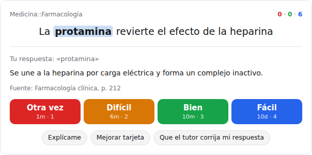
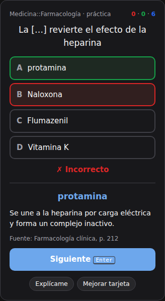

# RecallForge

**Anki con un tutor dentro: estudia con tarjetas en el chat de tu agente de IA.**

Le dices a tu agente (Claude, ChatGPT, Codex, Cursor, VS Code…) «vamos a repasar» y aparecen **tus tarjetas dentro del chat**: respondes, ves la respuesta y calificas con un clic o con el teclado, tan rápido como en Anki. Cuando algo no te queda claro, pulsas **«Explícame»** y el tutor te lo explica con tu propio material. Por debajo, **FSRS** (el algoritmo de Anki, ajustado a tu historial) decide qué toca repasar cada día.

- **Trae tus mazos de Anki** (.apkg, incluidos mazos compartidos como AnKing): con cloze, imágenes, etiquetas, tu progreso y tu historial.
- **Tu agente crea las tarjetas** desde tus PDF, diapositivas o apuntes, como borradores que revisas, citando la página exacta.
- **Llévalas al móvil**: exporta a `.apkg` y ábrelas en AnkiDroid o AnkiMobile.
- **Local y privado**: sin cuentas ni Docker; tus datos en un archivo de tu ordenador.

> Proyecto Vibecoding.

---

## Índice

- [Por qué](#por-qué)
- [Así se ve una sesión](#así-se-ve-una-sesión)
- [Instalación](#instalación)
- [Conectar tu agente](#conectar-tu-agente)
- [Estudiar dentro del chat](#estudiar-dentro-del-chat)
- [Trae tus mazos de Anki](#trae-tus-mazos-de-anki)
- [Cloze e imágenes](#cloze-e-imágenes)
- [De tus documentos a tarjetas](#de-tus-documentos-a-tarjetas)
- [Organización por materias](#organización-por-materias)
- [Mapa de progreso](#mapa-de-progreso)
- [Preparar un examen](#preparar-un-examen)
- [Modos de estudio](#modos-de-estudio)
- [Tú tienes el control](#tú-tienes-el-control)
- [Qué puede hacer el agente](#qué-puede-hacer-el-agente)
- [La web local](#la-web-local)
- [API REST](#api-rest)
- [Cómo decide qué preguntarte](#cómo-decide-qué-preguntarte)
- [Buenas tarjetas](#buenas-tarjetas)
- [Tus datos y privacidad](#tus-datos-y-privacidad)
- [Desarrollo](#desarrollo)
- [Qué cumple y qué no](#qué-cumple-y-qué-no)
- [Hoja de ruta](#hoja-de-ruta)

---

## Por qué

El **recuerdo activo** (intentar recordar la respuesta antes de verla) y la **repetición espaciada** (repasar justo antes de olvidar) son las dos técnicas de estudio con más evidencia. El problema es que hacer buenas tarjetas y mantener el hábito cuesta.

Un agente de IA resuelve las dos cosas:

- **Crea las tarjetas por ti** a partir de tus apuntes, un capítulo, una clase o un PDF.
- **Te pregunta como un tutor**: acepta respuestas con otras palabras, te explica lo que fallaste y recuerda tus errores anteriores.

RecallForge pone lo que el agente no tiene: una **memoria persistente**, un **programador de repasos** científico y un **mapa de lo que sabes**.

## Así se ve una sesión

En Claude, ChatGPT o VS Code, «vamos a repasar Farmacología» abre esto dentro de la conversación:

<p align="center">
  
  
</p>

Con agentes de solo texto (Codex en terminal, voz) la sesión es una conversación:

```
Tú:      Pregúntame lo pendiente de Farmacología.

Agente:  Tienes 12 tarjetas para hoy. Primera:
         ¿Cuál es el antídoto de la intoxicación por paracetamol?

Tú:      El flumazenil.

Agente:  No. El flumazenil revierte las benzodiacepinas. El antídoto del
         paracetamol es la N-acetilcisteína, que repone el glutatión.
         Volverá a salir en un minuto.
         Siguiente: ¿qué antídoto se usa en la sobredosis de opioides?

Tú:      Naloxona.

Agente:  ¡Correcto! La verás de nuevo en unos días.
```

Detrás, el agente llamó a `get_next_card`, `reveal_answer` y `grade_card`. RecallForge guardó tu respuesta («flumazenil») para que la próxima vez el agente pueda decirte que ya lo confundiste antes.

También puedes pedirle:

- «Importa mi mazo de Anki ~/Descargas/Farmacologia.apkg.»
- «Hazme tarjetas de este PDF» (o de este capítulo, estas diapositivas, estos apuntes).
- «¿Cómo voy? Enséñame mi mapa de progreso.»
- «Tengo examen de Microbiología el 20 de octubre: prepárame.»
- «Esa la califiqué mal, deshazla.»
- «Esa tarjeta está mal redactada, corrígela.»
- «Pásame todo a un .apkg para estudiar en el móvil.»
- «Ajusta el algoritmo a mi historial.»

## Instalación

Requisitos: [Node.js](https://nodejs.org) 22 o superior (20 funciona, salvo los `.apkg` del formato comprimido más reciente de Anki).

```bash
git clone https://github.com/jacmeydev/recallforge.git
cd recallforge
npm install        # también compila el comando recallforge (dist/cli.mjs)
npm run build      # opcional: compila la web local para que arranque rápido
```

Eso es todo: no hay que crear cuentas ni configurar nada. Tus datos se guardan en `~/.recallforge/recallforge.db` (se crea solo la primera vez).

## Conectar tu agente

RecallForge funciona como **servidor MCP por stdio**: tu agente lo arranca cuando lo necesita. Sustituye `/ruta/a/recallforge` por la carpeta donde lo clonaste (la web local te muestra la ruta exacta en *Agentes y ajustes*).

**Claude Code**

```bash
claude mcp add recallforge -- node /ruta/a/recallforge/dist/cli.mjs mcp
```

**Claude Desktop, Cursor, VS Code, Windsurf, Codex y cualquier cliente MCP** (archivo de configuración de servidores MCP):

```json
{
  "mcpServers": {
    "recallforge": {
      "command": "node",
      "args": ["/ruta/a/recallforge/dist/cli.mjs", "mcp"]
    }
  }
}
```

Al conectarse, el agente recibe automáticamente el **protocolo de estudio** (cómo preguntar sin dar pistas, evaluar el significado y calificar) y las **reglas de calidad** para crear tarjetas. También hay dos prompts: `study` (empezar sesión) y `make_cards` (convertir material en tarjetas).

**Agentes sin MCP** (OpenClaw, n8n, scripts): usan la [API REST](#api-rest) con la web local abierta. La skill [`skills/recallforge/SKILL.md`](skills/recallforge/SKILL.md) les enseña el protocolo y las llamadas; funciona con cualquier agente compatible con `SKILL.md`.

**Agentes en la nube** (Claude.ai, ChatGPT): necesitan llegar a tu ordenador por HTTPS. Ver [Acceso remoto](DEPLOYMENT.md): define un token (`RECALLFORGE_TOKEN`) y exponlo con un túnel.

## Estudiar dentro del chat

RecallForge es una **MCP App**: en los clientes que las muestran (Claude, ChatGPT, VS Code, Goose…) la herramienta `study` abre una tarjeta interactiva dentro del chat.

- **Rápido como Anki**: `Enter` muestra la respuesta, `1`–`4` califica, `Z` deshace. Imágenes, cloze y fuente con el fragmento exacto.
- **El tutor a un clic**: *Explícame* (el agente te lo explica con tu material), *Mejorar tarjeta* (propone cómo reescribirla), *Que el tutor corrija mi respuesta* (evalúa por significado lo que escribiste) y *Mi respuesta era correcta*.
- **El agente sabe lo que pasa**: el widget le cuenta en segundo plano cuántas llevas y cuáles fallaste, así que al terminar puede resumirte qué repasar sin que se lo expliques.
- **Todos los modos**: repaso, sesión rápida, examen, escribir, opción múltiple y verdadero/falso. `show_progress` muestra tu mapa de progreso en el chat, con botones para empezar a estudiar.

En clientes sin MCP Apps el agente hace la misma sesión conversando.

## Trae tus mazos de Anki

```bash
node dist/cli.mjs import ~/Descargas/AnKing.apkg --deck Medicina
```

o pídeselo al agente («importa ~/Descargas/Farmacologia.apkg»), o súbelo en *Agentes y ajustes*. Funciona con todos los formatos de paquete de Anki (incluido el actual, comprimido) y trae:

- notas básicas, **cloze** e **imágenes**; las tarjetas de *oclusión de imagen* se importan como «¿qué estructura está oculta?» con la imagen;
- subdecks y etiquetas (por ejemplo, las de AnKing);
- tarjetas suspendidas, tu **progreso** (el estado de memoria FSRS de Anki cuando existe) y tu **historial de repasos**.

Importar el mismo mazo otra vez solo añade lo nuevo. Y al revés: `node dist/cli.mjs export mazo.apkg` (o el botón *Mazo de Anki* en la web, o `export_data` en el agente) genera un paquete que abren Anki, **AnkiDroid y AnkiMobile**, con cloze, imágenes y programación, para repasar en el móvil.

**Algoritmo personalizado.** Con tu historial (unos 200 repasos, o el que traigas de Anki), `node dist/cli.mjs optimize`, el botón *Optimizar con mi historial* o la herramienta `optimize_scheduler` ajustan FSRS a cómo olvidas tú, con el mismo optimizador que usa Anki. Solo se aplica si predice tu memoria mejor que lo actual.

## Cloze e imágenes

- **Cloze** (completar huecos), con la misma sintaxis de Anki: `La {{c1::protamina}} revierte la {{c2::heparina::anticoagulante}}` crea dos tarjetas, «La […] revierte la heparina» y «La protamina revierte la [anticoagulante]». Las tarjetas de una misma nota no salen el mismo día, para que una no delate a la otra. Al editar el texto se actualizan todas.
- **Imágenes** (anatomía, histología, radiología, ECG): se guardan dentro de la base de datos y se insertan con ``. En la web hay un botón *Añadir imagen*; el agente usa `add_image`. Los agentes que ven imágenes las reciben junto con la tarjeta.

## De tus documentos a tarjetas

Pásale a tu agente cualquier material de estudio: PDF, Word (`.docx`), PowerPoint (`.pptx`), texto, Markdown, HTML o CSV. Las imágenes, los PDF escaneados y los vídeos también sirven si tu agente sabe leerlos (visión, transcripción): los convierte en texto y lo guarda con `add_document`.

1. **Dáselo al agente** (si sabe leer archivos, lo guarda él mismo con `add_document`) o **súbelo** en la web local (*Documentos*).
2. RecallForge lo divide en **partes** (páginas del PDF, diapositivas con sus notas del orador, secciones por título).
3. El agente lo lee parte por parte (`read_document`) y crea tarjetas siguiendo las reglas de calidad. Cada tarjeta queda **enlazada a su página** con el **fragmento exacto** del que sale (`excerpt`); RecallForge comprueba que ese fragmento está de verdad en esa página y avisa si no.
4. Las tarjetas generadas entran como **borradores**. Las revisas en *Por revisar* (o en el chat), corriges lo necesario y las apruebas. Solo entonces empiezan a salir en tus repasos.
5. En la ficha del documento ves qué páginas ya tienen tarjetas y cuáles no.

**Control de calidad antes de guardar.** Cada tarjeta nueva se compara con lo que ya tienes en esa asignatura y se revisa. Se avisa de:
- **duplicados** y casi duplicados (la misma pregunta con otras palabras);
- **contradicciones**: una pregunta parecida a otra que ya tienes pero con una respuesta distinta;
- fragmentos de la fuente que no aparecen en la página indicada, o tarjetas sin fragmento;
- preguntas de sí/no, preguntas que ya contienen la respuesta, respuestas que son listas largas, textos demasiado largos.

El agente puede hacer una **prueba sin guardar** (`dry_run`) para resolver esos avisos antes de crear nada, y tú los ves al revisar los borradores.

RecallForge no usa ninguna IA propia ni necesita claves de pago: el trabajo inteligente lo hace **tu** agente, y RecallForge aporta la estructura, la memoria y el control de calidad. Los PDF escaneados sin texto no se pueden extraer; en ese caso el agente puede leerlos con visión y pasar el texto.

## Organización por materias

Las materias son jerárquicas, con `::` como separador, igual que en Anki:

```
Medicina
├── Anatomía
│   └── Miembro superior
└── Farmacología
    ├── Antibióticos
    └── Cardiovascular
```

- Al crear `Medicina::Farmacología::Antibióticos` se crean solas las materias superiores que falten.
- Cada materia muestra sus tarjetas propias y los **totales con todas sus submaterias**.
- Estudiar o buscar en `Medicina::Farmacología` incluye todas sus submaterias.
- Renombrar o mover una materia arrastra sus submaterias; borrarla borra todo el subárbol.
- Las **etiquetas** sirven para temas transversales (`alto-rendimiento`, `parcial-2`, `cardio::arritmias`).

## Mapa de progreso

En la web (*Progreso*) o pidiéndoselo al agente (`get_progress_map`):

- **Árbol de materias con su dominio**: la probabilidad media, según FSRS, de que recuerdes ahora mismo cada tarjeta de esa materia (las que nunca estudiaste cuentan como 0). También cuánto has estudiado ya, cuántas están consolidadas (estabilidad de 21 días o más) y cuántas son débiles.
- **Mapa de calor** de los últimos 6 meses, estilo GitHub, con los días que has estudiado.
- **Cobertura de documentos**: qué parte de cada documento ya tiene tarjetas.
- **Preparación de exámenes**: cuánto se prevé que recuerdes el día del examen.
- **Tiempo estimado**: minutos para lo pendiente de hoy y para los próximos 7 días, calculados con tu propio ritmo (mediana de tus últimos repasos).
- **Qué hacer ahora**: una lista corta y ordenada de acciones (examen en riesgo, temas sin estudiar antes del examen, pendientes de hoy, tarjetas que se olvidan una y otra vez, borradores, partes de documentos sin tarjetas), cada una con su botón.

Nada de esto obliga a nada: no hay avisos, puntos ni insignias; es información para decidir. (La racha solo aparece como dato en `get_stats`.)

## Preparar un examen

1. Pon la **fecha del examen** en la materia (web: página de la materia; agente: `update_deck` con `exam_date`). Se aplica también a sus submaterias.
2. Estudia en **modo examen** (web: «Repasar para el examen»; agente: `get_next_card` con `mode: "exam"`). Ignora el calendario normal y los límites diarios y te pregunta primero las tarjetas que tienes más riesgo de olvidar **el día del examen**, empezando por las que nunca has visto.
3. El mapa de progreso muestra tu **recuerdo previsto el día del examen** por materia. La sesión termina cuando todas las tarjetas están previstas por encima de tu retención objetivo.

**Deshacer y tarjetas «sanguijuela».** Si calificaste mal, «Deshacer» (tecla Z en la web, `undo_last_review` en el agente) deja la tarjeta exactamente como estaba. Cuando una tarjeta se olvida 4 veces después de haberla aprendido, se marca con la etiqueta `leech` y el agente te propone reescribirla (dividirla, añadir una mnemotecnia o aclarar la pregunta).

## Modos de estudio

En la web se eligen arriba de la tarjeta; el agente los pasa a `get_next_card` y `grade_card`.

| Modo | Qué hace | ¿Cambia la programación? |
|---|---|---|
| **Repaso** (por defecto) | La cola de repetición espaciada con tus límites diarios. | Sí |
| **Sesión rápida** (`mode: "quick"`) | Solo lo que ya toca, sin tarjetas nuevas, 10 como máximo. Para un rato libre. | Sí |
| **Examen** (`mode: "exam"`) | Lo que más riesgo tiene de olvidarse el día del examen, sin límites diarios. Separado de la cola diaria. | Sí, las respondidas |
| **Escribir** (`format: "typing"`) | Escribes la respuesta; se compara con la esperada como pista, pero la nota la decides tú (o el agente, por significado). | Sí |
| **Opción múltiple** (`format: "multiple_choice"`) | 4 opciones: la correcta y respuestas reales de tus otras tarjetas de la misma asignatura. Corrección inmediata. | No (práctica) |
| **Verdadero/falso** (`format: "true_false"`) | Se muestra una respuesta, correcta o de otra tarjeta, y dices si es la buena. | No (práctica) |

Opción múltiple y verdadero/falso miden reconocimiento, no recuerdo, así que se guardan como **práctica**: no mueven la tarjeta ni cuentan en tus límites ni en tu retención.

Además, en cada tarjeta:

- **«Explícame esto»**: muestra la explicación, el texto de la fuente alrededor del fragmento (resaltado), tus errores anteriores y tarjetas relacionadas. Con el agente (`explain_card`) obtienes una explicación a fondo basada en esa misma fuente.
- **«Mi respuesta era correcta»**: si la nota fue *Otra vez* o *Difícil* y tu respuesta valía (un sinónimo, otro nombre del fármaco), la corriges y la tarjeta se reprograma como si la hubieras calificado bien desde el principio (`correct_grade`).
- **Reformulación**: cuando ya has visto una tarjeta muchas veces, el agente recibe `suggestRephrase` y te la pregunta con otras palabras o desde otro ángulo, para que la recuerdes y no la reconozcas por la forma.

## Tú tienes el control

La IA propone; tú decides.

- **Las tarjetas generadas son borradores** hasta que las apruebas. El agente nunca aprueba por su cuenta.
- **Toda edición queda registrada** (quién: agente, web o API; cuándo; por qué; antes y después) y se puede **restaurar** con un clic (*Historial* en la materia, `card_history` / `revert_revision` en el agente).
- **La calificación nunca es opaca**: el agente dice qué nota pone y por qué, acepta sinónimos y respuestas equivalentes, y tú puedes corregirla o deshacerla.
- **Tú decides qué estudiar**: por materia, subtema, etiqueta, modo y formato; y ajustas la retención objetivo, los límites diarios y los pasos de aprendizaje.

## Qué puede hacer el agente

| Herramienta | Qué hace |
|---|---|
| `study` | Abre la sesión de estudio interactiva dentro del chat (MCP Apps). |
| `show_progress` | Muestra el mapa de progreso en el chat, con botones para empezar. |
| `get_next_card` | Da la siguiente pregunta, **sin la respuesta**. Filtros: materia, etiqueta, `mode` (`normal`, `quick`, `exam`) y `format` (`recall`, `typing`, `multiple_choice`, `true_false`). |
| `reveal_answer` | Da la respuesta, la explicación, la fuente con su fragmento, tus intentos anteriores y cuándo volvería la tarjeta con cada calificación. |
| `grade_card` | Registra cómo recordaste (`again`, `hard`, `good`, `easy`) o la opción elegida en práctica; avisa si es una sanguijuela y devuelve la siguiente pregunta. |
| `correct_grade` | «Mi respuesta era correcta»: cambia la nota del último repaso y reprograma. |
| `undo_last_review` | Deshace la última calificación. |
| `explain_card` | Material para explicar una tarjeta: fuente exacta y su contexto, intentos, tarjetas relacionadas. |
| `get_stats` | Progreso de hoy, pendientes con minutos estimados, retención real de 30 días, previsión de 7 días y tarjetas más difíciles. |
| `get_progress_map` | Mapa de dominio por materia, preparación de exámenes, recomendaciones, mapa de calor y cobertura de documentos. |
| `add_cards` | Crea hasta 500 tarjetas (con su fragmento de origen), opcionalmente como borradores; detecta duplicados y contradicciones; `dry_run` para comprobar sin guardar. |
| `approve_cards` | Aprueba borradores (por id, por documento o por materia). |
| `add_document`, `list_documents`, `read_document`, `delete_document` | Material de estudio: guardarlo, listarlo, leerlo parte por parte con su cobertura, borrarlo. |
| `search_cards` | Busca por texto, materia, etiqueta, documento o estado (`new`, `due`, `leech`, `draft`…). |
| `update_card`, `delete_cards` | Corrige (con motivo), reetiqueta, mueve, suspende o borra tarjetas. |
| `card_history`, `revert_revision` | Historial de cambios de una tarjeta y restaurar una versión anterior. |
| `import_data` | Importa mazos de Anki (.apkg/.colpkg), copias JSON o CSV/TSV, desde una ruta de tu ordenador o como texto. |
| `export_data` | Escribe un `.apkg` (Anki, AnkiDroid, AnkiMobile), la copia JSON completa o un TSV. |
| `add_image` | Guarda una imagen y devuelve el texto para ponerla en una tarjeta. |
| `optimize_scheduler` | Ajusta FSRS a tu historial de repasos. |
| `list_decks`, `update_deck`, `delete_deck` | Árbol de materias; renombrar, mover, poner fecha de examen o borrar. |
| `update_settings` | Nuevas por día, repasos por día, retención objetivo, zona horaria. |

## La web local

```bash
node dist/cli.mjs ui          # http://127.0.0.1:3030
```

*Inicio* (materias, pendientes y tiempo estimado), *Repasar* (todos los modos), *Documentos*, *Por revisar*, *Progreso* y *Agentes y ajustes* (incluye importar y exportar). Solo escucha en tu ordenador (`127.0.0.1`), funciona sin internet y se adapta igual a móvil que a escritorio. En la web: `Espacio`/`Enter` muestra la respuesta, `1`–`4` califica, `Z` deshace.

Comandos:

```bash
node dist/cli.mjs stats                  # resumen de hoy
node dist/cli.mjs export copia.json      # copia completa (o copia.tsv para Anki / Excel)
node dist/cli.mjs backup                 # copia del archivo .db en ~/.recallforge/backups
node dist/cli.mjs import archivo         # restaura un JSON o importa CSV/TSV [--deck Materia] [--draft]
node dist/cli.mjs path                   # dónde están tus datos
```

## API REST

Disponible mientras la web local está abierta (`http://127.0.0.1:3030`). En local no necesita credenciales; con `RECALLFORGE_TOKEN` definido, envía `Authorization: Bearer <token>`. `GET /api/v1` devuelve el índice de endpoints.

| Método | Ruta | Descripción |
|---|---|---|
| GET | `/api/v1/study/next?deck=&tag=&mode=&format=` | Siguiente pregunta (con opciones o afirmación en práctica) |
| POST | `/api/v1/study/reveal` | `{ cardId }` → respuesta, explicación, fuente, intentos, intervalos |
| POST | `/api/v1/study/grade` | `{ cardId, rating?, answer?, feedback?, durationMs?, mode?, format?, choice?, statement?, answerTrue?, deck?, tag? }` → resultado y siguiente pregunta |
| POST | `/api/v1/study/correct` | `{ cardId, rating, reason? }` → «mi respuesta era correcta» |
| POST | `/api/v1/study/undo` | `{ cardId? }` → deshace la última calificación |
| GET | `/api/v1/stats?deck=&tag=` | Estadísticas |
| GET | `/api/v1/progress?days=` | Mapa de progreso |
| GET, POST | `/api/v1/decks` | Listar o crear materias |
| GET, PATCH, DELETE | `/api/v1/decks/{id o nombre}` | Ver, renombrar/mover/poner `examDate`, borrar |
| GET, POST | `/api/v1/cards` | Buscar (`query, deck, tag, documentId, state, limit, offset`) o crear en lote (`deck?, documentId?, draft?, dryRun?, cards[]`) |
| GET, PATCH, DELETE | `/api/v1/cards/{id}` | Ver, editar (`reason?` queda en el historial) o borrar una tarjeta |
| GET | `/api/v1/cards/{id}/explain` | Fuente exacta con contexto, intentos y tarjetas relacionadas |
| GET | `/api/v1/cards/{id}/revisions` | Historial de cambios |
| POST | `/api/v1/revisions/{id}/revert` | Restaurar la versión anterior a un cambio |
| POST | `/api/v1/cards/{id}/reset` | Reiniciar el progreso de una tarjeta |
| POST | `/api/v1/cards/approve` | `{ ids?, documentId?, deck? }` → aprobar borradores |
| GET, POST | `/api/v1/documents` | Listar documentos / subir uno (`multipart` con `file`, `deck?`, `title?`, o JSON `{ title, text, deck? }`) |
| GET, PATCH, DELETE | `/api/v1/documents/{id}` | Índice con cobertura / renombrar / borrar (`?deleteCards=true`) |
| GET | `/api/v1/documents/{id}/read?fromPart=&maxChars=` | Texto de las partes siguientes |
| GET, PATCH | `/api/v1/settings` | Ajustes de estudio |
| GET | `/api/v1/export?format=json\|apkg\|tsv&deck=` | Exportar todo (JSON), un mazo de Anki o las tarjetas en TSV |
| POST | `/api/v1/import` | Importar `.apkg`, JSON de RecallForge o CSV/TSV (`multipart` con `file`, `deck?`, `draft?`, o el texto tal cual) |
| POST, GET | `/api/v1/media`, `/api/v1/media/{id}` | Subir una imagen (`multipart` con `file`) / descargarla |
| POST | `/api/v1/settings/optimize` | Ajustar FSRS a tu historial (`{ apply? }`) |

```bash
URL=http://127.0.0.1:3030
curl -X POST $URL/api/v1/cards -H 'content-type: application/json' \
  -d '{"deck":"Medicina::Farmacología","cards":[{"front":"Antídoto de la heparina","back":"Sulfato de protamina"}]}'
curl $URL/api/v1/study/next
```

Los errores siempre tienen la forma `{ "error": { "code", "message", "details?" } }`.

## Cómo decide qué preguntarte

- **FSRS** calcula para cada tarjeta cuánto la recuerdas (estabilidad) y la programa para cuando tu probabilidad de recordarla baje a la **retención objetivo** (90 % por defecto).
- **Orden de la cola:** primero las tarjetas que estás aprendiendo y ya tocan, luego los repasos del día y después las nuevas.
- **Pasos de aprendizaje** cortos (1 min y 10 min): si fallas una tarjeta, vuelve a salir en la misma sesión.
- **Límites diarios** de nuevas (20) y repasos (200) por **día de estudio** en tu zona horaria; el día empieza a las 4:00 para que estudiar de madrugada cuente como el día anterior.
- **Carga previsible:** los límites diarios fijan cuánto entra cada día y la previsión de 7 días te dice cuántos repasos y minutos vienen. La retención objetivo, los límites y los pasos se cambian en *Agentes y ajustes*.
- **Historial:** cada repaso guarda la calificación, tu respuesta, el comentario del agente, el modo, el formato y el estado previo de la tarjeta (para deshacer o corregir).

## Buenas tarjetas

El agente ya sigue estas reglas, pero sirven también si las haces a mano:

- **Una idea por tarjeta**, con una sola respuesta posible.
- Preguntas que obliguen a recordar («¿por qué…?», «¿qué…?», «¿cuál…?») mejor que preguntas de sí o no.
- **`back`**: la respuesta corta. **`explanation`**: el contexto, la mnemotecnia o la relevancia clínica. **`source`**: libro, capítulo o página.
- **Nada inventado**: cada tarjeta debe estar respaldada por el material.
- Una **materia** jerárquica por asignatura y tema, y **etiquetas** para temas transversales.

## Tus datos y privacidad

- Todo se guarda en **un solo archivo** SQLite: `~/.recallforge/recallforge.db`. Cámbialo con la variable `RECALLFORGE_DB`. La web y los agentes comparten ese archivo.
- No hay cuentas, ni telemetría, ni servicios externos. La web solo escucha en `127.0.0.1`.
- **Nada queda encerrado**: la exportación JSON lleva todo (materias, fechas de examen, documentos con su texto, tarjetas con su estado de memoria, cada repaso y cada edición) y se vuelve a importar sin duplicar; la exportación TSV la abren Anki y cualquier hoja de cálculo.
- **Copias de seguridad**: `node dist/cli.mjs backup` (copia segura del `.db` aunque esté en uso), `node dist/cli.mjs export copia.json`, o los botones de *Agentes y ajustes*.
- **Importar**: copias JSON de RecallForge y CSV/TSV (en Anki: *Archivo → Exportar → Notas en texto plano*), desde la web, el agente o `node dist/cli.mjs import`.
- **Si vienes de una versión anterior**, la base se migra sola al arrancar: tus tarjetas pasan al formato pregunta/respuesta sin perder su progreso ni su historial, y las tablas antiguas se conservan como `legacy_*`. Para usar esa base, apunta `RECALLFORGE_DB` a ella.

Variables opcionales:

| Variable | Por defecto | |
|---|---|---|
| `RECALLFORGE_DB` | `~/.recallforge/recallforge.db` | Archivo de datos |
| `RECALLFORGE_TOKEN` | — | Exige este token en la web y la API (solo para acceso remoto) |
| `PORT` | `3030` | Puerto de la web local |
| `BASE_URL` | — | URL pública que se muestra en las instrucciones de conexión |

## Desarrollo

```bash
npm run dev         # web local en modo desarrollo (127.0.0.1:3030)
npm run build:cli   # recompila dist/cli.mjs (MCP por stdio)
npm run build:widget  # recompila el widget del chat (src/widget → src/lib/mcp/widget.generated.ts)
npm test            # vitest: núcleo, cloze, imágenes, Anki (paquetes reales), optimizador, documentos, API, MCP y MCP Apps
npm run typecheck
npm run lint
npm run build
```

```
src/cli.ts        comando recallforge (MCP por stdio, web, stats, import, export, backup, optimize)
src/lib/core/     dominio: esquema, FSRS, materias, tarjetas, cloze, imágenes, Anki, documentos, estudio, progreso
src/lib/mcp/      servidor MCP: herramientas, MCP App (widget) y protocolo de estudio
src/widget/       widget de estudio que se muestra dentro del chat (npm run build:widget)
src/lib/api/      acceso (token opcional) y utilidades para las rutas
src/app/api/v1/   API REST
src/app/api/mcp/  MCP por HTTP (para agentes remotos)
src/app/          web local
skills/           skill para agentes
tests/            pruebas
```

Tecnologías: Node.js, TypeScript, SQLite (better-sqlite3), ts-fsrs, MCP TypeScript SDK, Next.js 16, React 19, Tailwind y Vitest.

## Qué cumple y qué no

| Requisito | Cómo |
|---|---|
| Velocidad y estabilidad | SQLite local con índices; siguiente tarjeta + calificación en milisegundos incluso con 20 000 tarjetas (hay una prueba automática que lo mide). |
| Crear tarjetas con poco esfuerzo | PDF, Word, PowerPoint, texto, HTML → partes → el agente crea **borradores editables**, básicos o cloze, con imágenes. Mazos de Anki en un comando. Escaneos y vídeos, a través de tu agente. |
| Control del usuario | Corregir la nota, deshacer, editar con historial y restaurar, elegir materia, etiqueta, modo y formato. |
| Algoritmo confiable y configurable | FSRS con retención objetivo, límites diarios y pasos ajustables, **optimizado con tu propio historial**; previsión de 7 días en repasos y minutos. |
| Modos | Repaso, sesión rápida, examen, escribir, opción múltiple y verdadero/falso. |
| Contexto y fuentes | Documento, página/diapositiva/sección y fragmento exacto en cada tarjeta, verificado contra el texto. |
| Propiedad de los datos | Un archivo local, sin cuentas; exportación `.apkg`, JSON completa y TSV; importación `.apkg`, JSON, CSV y TSV; `backup`; funciona sin internet. |
| Interfaz limpia | Sin anuncios, ventanas emergentes ni gamificación obligatoria; la misma interfaz en el chat, en la web, en móvil y en escritorio (modo claro y oscuro). |
| Progreso comprensible | Dominio por tema, tarjetas débiles, tiempo estimado, preparación del examen y «qué hacer ahora». |
| IA supervisada | Propone borradores y cambios con motivo; nunca aprueba sola; la nota se explica y se puede corregir. |
| Duplicados y contradicciones | Se detectan antes de guardar, con prueba sin guardar (`dry_run`). |
| Reformular preguntas | `suggestRephrase` pide al agente otra formulación en las tarjetas muy vistas. |
| Calificación semántica corregible | El agente califica por significado (sinónimos, nombres equivalentes) y «Mi respuesta era correcta». |
| «Explícame esto» | Botón en cada tarjeta (web) y `explain_card` (agente). |
| Examen separado del repaso espaciado | Cola propia sin límites diarios; la práctica de opción múltiple y V/F no toca la programación. |

**Limitaciones conocidas**: RecallForge no incluye una IA propia, así que la calificación semántica, las explicaciones a fondo, la reformulación y la lectura de escaneos o vídeos las hace tu agente; en la web sin agente te autoevalúas tú. La oclusión de imagen de Anki se importa como pregunta sobre la imagen, sin dibujar las máscaras. En el móvil se estudia a través del `.apkg` (AnkiDroid/AnkiMobile) o del chat de tu agente si lo conectas por [acceso remoto](DEPLOYMENT.md); no hay sincronización automática.

## Hoja de ruta

- Oclusión de imagen nativa (dibujar máscaras sobre la imagen) y extracción de imágenes de los PDF y diapositivas.
- Sincronización con Anki en ambos sentidos (AnkiConnect) para repasar en el móvil sin exportar a mano.
- Publicación en npm para instalar con `npx recallforge`.
- OCR para PDF escaneados.
- Recordatorios: un agente programado que consulte `get_stats` cada mañana y te avise.
